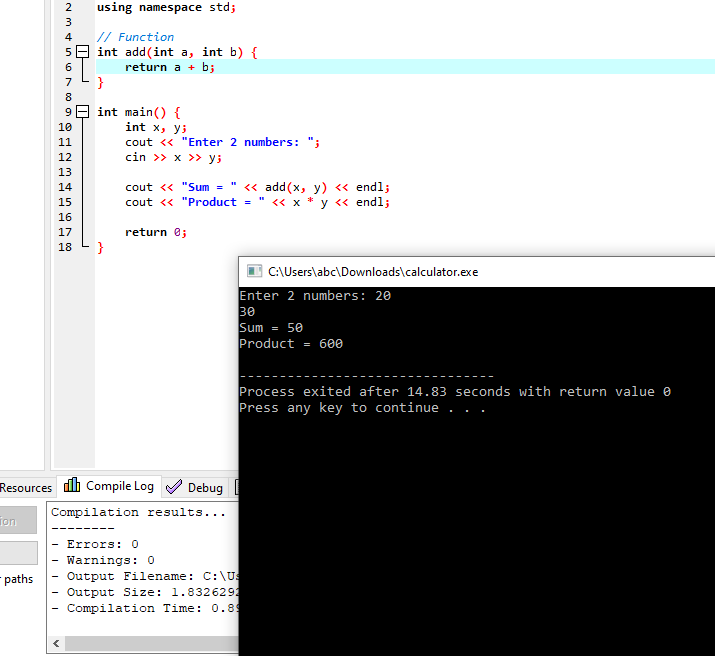
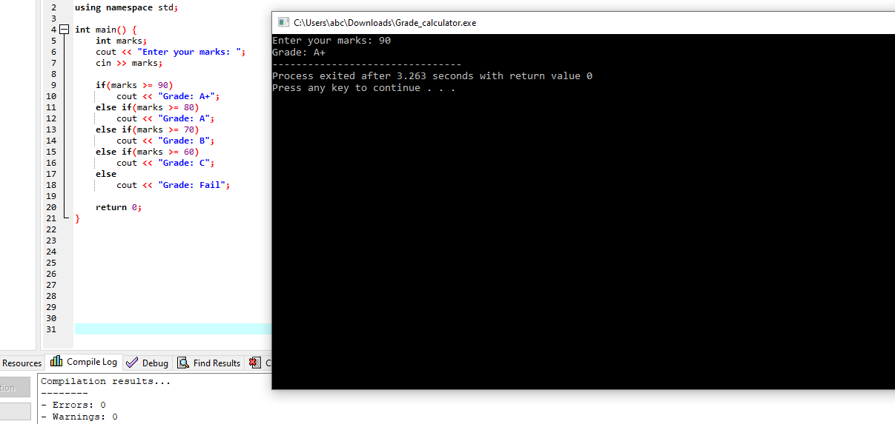
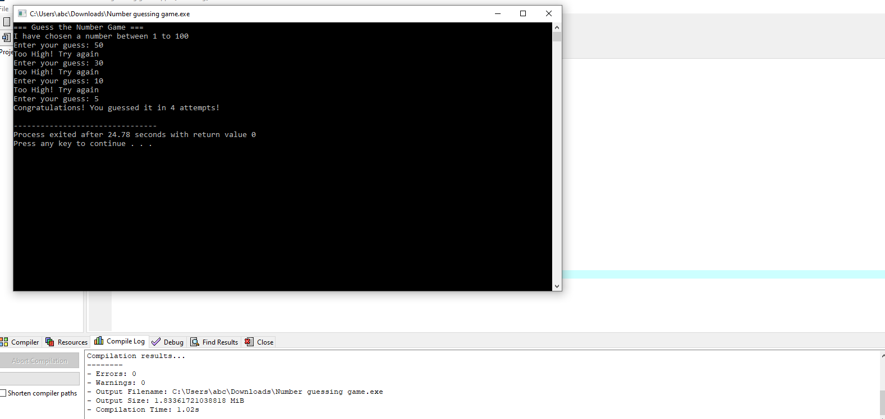
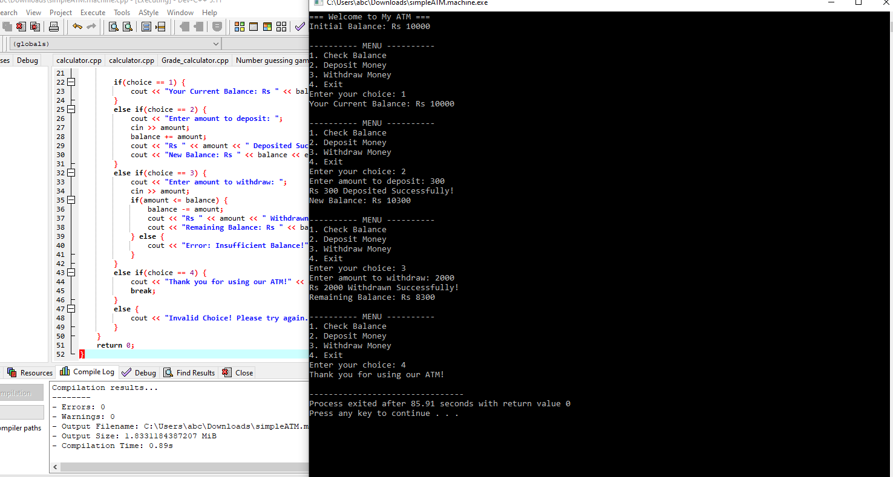
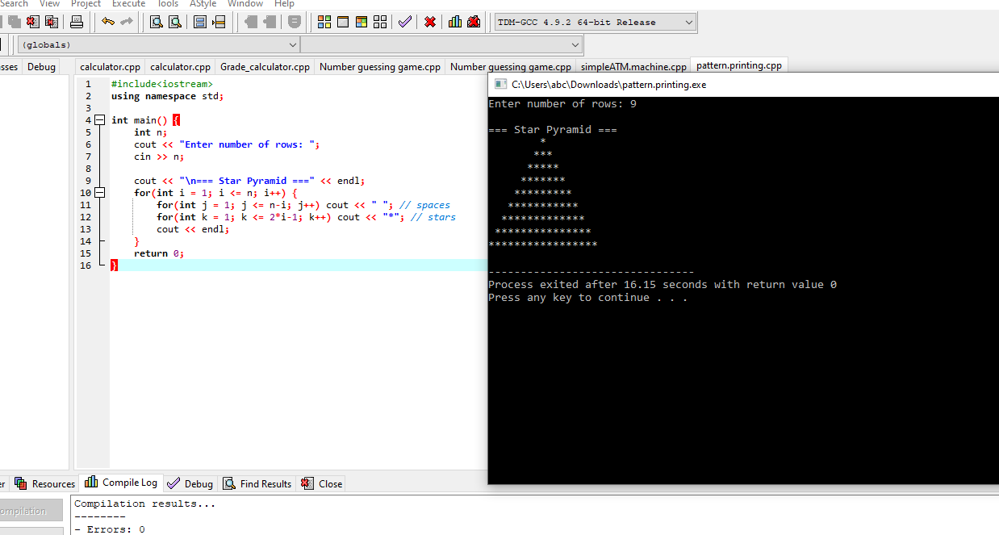

My-CPP-Projects
\\About
Collection of 5 beginner C++ console programs built while learning fundamentals of Computer Science.
\\Projects List
1.Calculator - Basic arithmetic operations
2.Grade Calculator- Marks to grade conversion  
3. Number Guessing Game - Interactive game with hints
4.ATM Machine - Deposit, Withdraw, Balance Check
5.Pattern Printing- Star pyramid using loops
\\Tech Used
- Language: C++
- IDE: Dev-C++
- Concepts: Functions, Loops, Conditionals, Menu-Driven Programs
  \\Screenshots
 1. Calculator

 2. Grade Calculator

3. Number Guessing Game

4. ATM Machine

5. Pattern Printing

